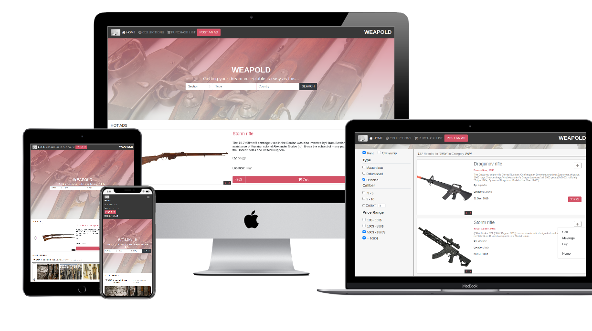

# Project Name
# Internet-Shop
> This project is the capstone of Microverse HTML/CSS curriculum module.



This project is the final in the Microverse HTML & CSS module - CAPSTONE. It's a real-world-like project, built with business specifications. The project for the HTML & CSS Capstone Project is based on an online shop for electronics. The given design of the website should be followed, but the content is personalized. Project build for 3 screen sizes, small up to 576px wide, tablet size up to 768px and bigger screen sizes more than 768px. Bootstrap is used for responsive layout and JS actions.
I chose the weapon collectibles for my e-store page, as it is a very popular segment of business with millions of dollars in turnover and costs of items reaching thousands per separate one. The page has a responsive navbar menu collapsing by changing screen size from large to smaller, SEARCH bar leads to the search results page. Page layout changes accordingly to the viewer's screen size to nicely fit the content. There are two pages available for displaying: the main page (search page) and the search results page. Switch between them by clicking the search button on the main page, and HOME anywhere on the search results page.

Project video presentation here:
[Video Presentation](https://drive.google.com/file/d/1Um8yqWg2SMsyOGK7QdTAFVgQ2FoICFVC/view)

## Built With

- HTML/CSS/SCSS/JS
- Fontawesome library
- Bootstrap
- MDBootstrap library

## Live Demo

[Live Demo Link](https://igors78.github.io/Internet-Shop/)

## Getting Started


To get a local copy up and running follow these simple example steps.

### Prerequisites
- Any PC or device with internet connection and ability to use command line terminal
### Setup
- Open the command line terminal
### Install
- Go to your preferred directory
- Run [ ```git clone https://github.com/Igors78/Internet-Shop.git```] command
### Usage
- Open index.html file in any modern browser
### Run tests
- Tests passed can be found here (https://github.com/Igors78/Internet-Shop/pulls)
### Deployment
- Page deployed through the Github pages service and can be viewed through the Live Demo Link (see above)


## Author

👤 **Igors Oleinikovs**

- GitHub: [@Igors78](https://github.com/Igors78)
- Twitter: [@oleinikovs](https://twitter.com/oleinikovs)
- LinkedIn: [LinkedIn](https://www.linkedin.com/in/igors-oleinikovs-17a10958/)

## 🤝 Contributing

Contributions, issues, and feature requests are welcome!

Feel free to check the [issues page](https://github.com/Igors78/Internet-Shop/issues).

## Show your support

Give a ⭐️ if you like this project!

## Acknowledgments


- Thanks to Bootstrap
- Thanks to stand-up team for raising issues and giving constructive critics out
- Thanks to Mohammed Awad [Mohammed Awad](https://www.behance.net/M_Awad) 
- [Design page Link](https://www.behance.net/gallery/24796463/ZATTIX)


## 📝 License

This project is [UNI](LICENSE) licensed.